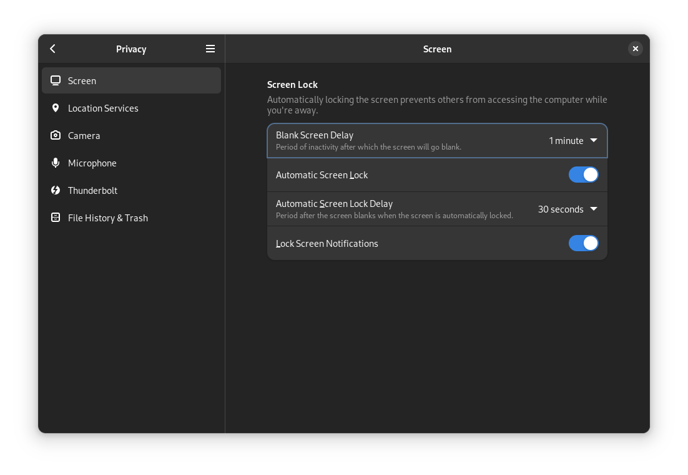
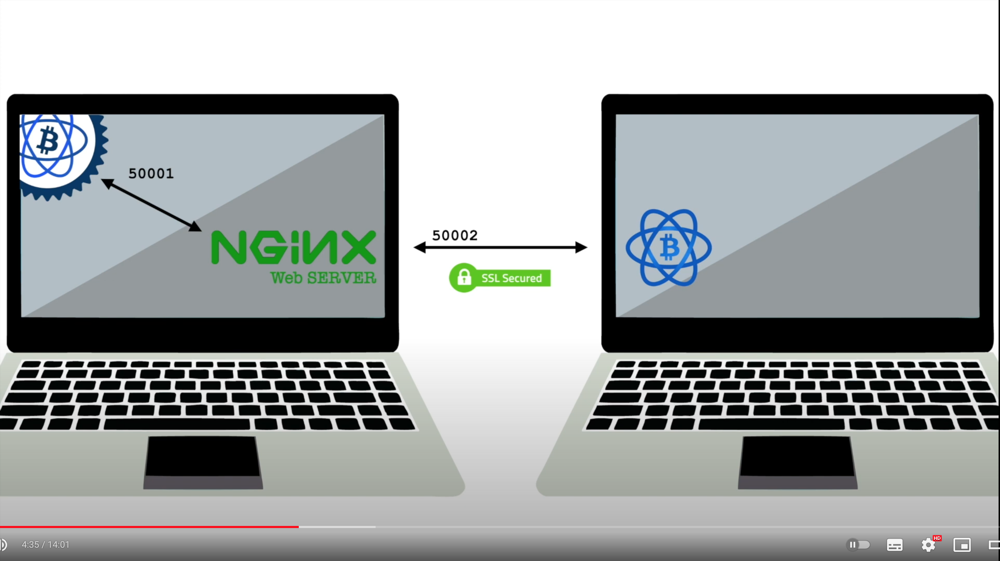
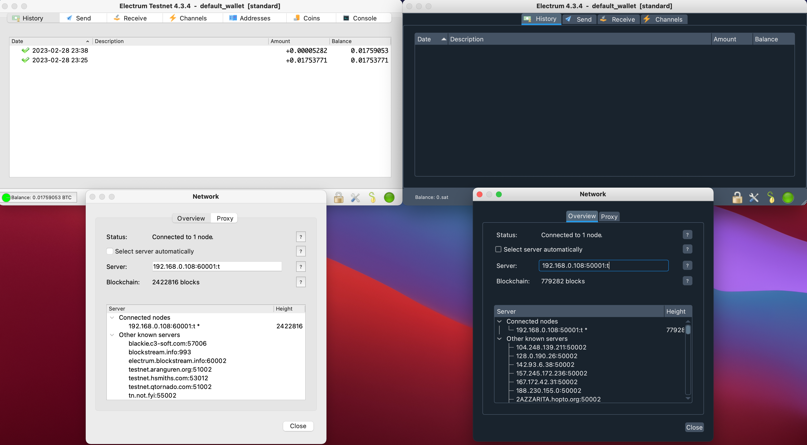

# Bitcoin full node guide
this repository serves me as guide for installing Bitcoin full node on home Linux server<br>

I am writing this guide for myself in case I will need to go over Bitcoin full node (and related services) installation again in the future. 
I am not an expert in Bitcoin neither Linux, but I haven't found all-in-one guide covering path "from 0 to hero" anywhere on 
the internet yet, so I have decided to create one for myself. I would like to ask potential other readers (if any), open issue or 
even better open PR, in case you will find some mistake, I am in the end just a simple guy.

## setup
- old laptop Lenovo Thinkpad X240 with 8GB RAM and 1TB SSD (server)
- old Macboook Pro (client)

I want to use old Lenovo as a server hosting all Bitcoin related services and my Macbook Pro as client from which I will ssh 
into server and use other connected service through web browser.

## server OS 
**goal of this section:** to have clean installation of Linux distribution

I want some reliable Linux distribution so I did some quick research and came up with idea that Debian is the way. I found this 
[video](https://youtu.be/CJ41KZ0fBMc) where the guy explains installation fairly simply. After creating booting USB (16GB) with 
[balena etcher](https://www.balena.io/etcher) I installed:
- Debian bookworm with weekly updates
- GNOME windows environment

Luckily this Debian version doesn't require any additional tweaking and everything worked out of the box.<br>

To work more efficiently I use combination of zsh and starship installed according 
to this [tuotiral](https://harshithashok.com/tools/oh-my-zsh-with-starship/).

## server initial setup
**goal of this section:** daily user has sudo permissions, laptop works with closed lid, client can ssh to server

During installation I created root user and my daily user, which I added to sudoers group following this 
[guide](https://linuxize.com/post/how-to-add-user-to-sudoers-in-debian/).<br>

To disable sleep after closing laptop lid I update (uncomment and change) `HandleLidSwitch=ignore` in 
`/etc/systemd/logind.conf` file and privacy setup as:

which ensures that after opening lid user password is required.<br>

To be able to connect from my client laptop to the linux server I had to setup `openssh-server` according to this 
[guide](https://phoenixnap.com/kb/how-to-enable-ssh-on-debian). For a firewall I didnt use ufw as I had some issues with it and open ports directly in **iptables** following this [tutorial](https://adamtheautomator.com/iptables-rules/). Regarding iptables tables I found [this repository](https://github.com/trimstray/iptables-essentials#debian-based), which has a ton of useful info.<br>

Once I enabled SSH I had to upload my client's SSH key to the server. I faced a small issue, because this wasn't my first server setup I had to reset server's fingerprint on my client with command `ssh-keygen -R <IP address of the server>`. To ssh into server without inserting user password run `ssh-copy-id -i ~/.ssh/<client-ssh-key>.pub <server-ip-address>`.

## Bitcoin Core on the server
**goal of this section:** Bitcoin Core (mainnet, testnet) runs as daemon and starts automatically after server restart

### Bitcoin Core initial setup
As I plan to potentially develop features in Bitcoin Core I want to have version built from github repository. For that I followed the notes for [unix build notes](https://github.com/bitcoin/bitcoin/blob/master/doc/build-unix.md) and specifically [ubuntu and debian](https://github.com/bitcoin/bitcoin/blob/master/doc/build-unix.md#ubuntu--debian) version.<br>

Once Bitcoin Core is setup I can run it as daemon with command `bitcoind -daemon` to start Bitcoin Core main chain. In be able to do [IBD](https://btcinformation.org/en/glossary/initial-block-download)<br>

To start Bitcoin Core testnet chain I have to run `bitcoind -testnet -daemon`<br>

Next step is to config Bitcoin Core via [Jameson Lopp's Bitcoin Core Generator](https://jlopp.github.io/bitcoin-core-config-generator/). My current setup looks like this:
```
# Generated by https://jlopp.github.io/bitcoin-core-config-generator/

# This config should be placed in following path:
# ~/.bitcoin/bitcoin.conf

[main]
daemon=1
maxconnections=20
maxuploadtarget=250

[test]
daemon=1
maxconnections=20
maxuploadtarget=250
# Enable debug logging for all categories.
debug=1
# Log IP Addresses in debug output.
logips=1
```
As guide says this config has to be placed in `~/.bitcoin/bitcoin.conf`

### Bitcoin Core runs as service and automatically starts after server restart
For running Bitcoin Core as a service I followed this [guide](https://gist.github.com/jeffrade/0b730d226ff6f6b985f802d3c9191023) which was quite straightforward. I created second service to run Bitcoin Core on testnet as well. I found these two articles about multiple Bitcoin chains running on same servers. Maybe someone found them useful: [article 1](https://raphtyosaze.medium.com/how-to-run-multiple-bitcoin-blockchain-networks-on-the-same-computer-4efa031e7d26), [article 2](https://number1.co.za/running-a-mainnet-and-testnet-on-the-same-bitcoin-node/)

## recap what has been done so far
- set up old laptop as debian server
- connect other laptop to the server via ssh
- install Bitcoin Core from official github repository on the server
- set up Bitcoin Core daemons for main and test nets running as services

## install Fulcrum Server on the server
To be able to work with Bitcoin blockchain data I need indexed blockchain. For that purpose I chose [Fulcrum](https://github.com/cculianu/Fulcrum).<br>

**goal of this section:** Fulcrum Server is isntalled and runs as service, which starts automatically after server is restarted<br>

Installation and initial setup was done following [video tutorial](https://youtu.be/SpQRrbJt7cg) from Ministry of Nodes. <br>

In the video MoN mentions using parameter `fast-sync = 3000`, but when I tried to run Fulcrum with this parameter (default is 0), a syncing process was crashing so I avoid using this option and full sync of the Fulcrum server took around 3 days. 

My Fulcrum configs for mainnet and tested are same as a default config except these changes:
```
datadir = <path-to-fulcrum-repo>/fulcrum_db
bitcoind = 127.0.0.1:8332
rpcuser = <rpcuser-generated-by-script-described-below>
rpcpassword = <rpcpassword-generated-by-script-described-below>
tcp = 127.0.0.1:50001
peering = false
```
electrs config for testnet:
```
datadir = <path-to-fulcrum-repo>/fulcrum_testnet_db
bitcoind = 127.0.0.1:18332
rpcuser = <rpcuser-generated-by-script-described-below>
rpcpassword = <rpcpassword-generated-by-script-described-below>
tcp = 127.0.0.1:60001
peering = false
```

Fulcrum Server requires RPC authentication setup in Bitcoin Core config, thus update to the **bitcoin.conf** is required. After the update following [this](https://www.youtube.com/watch?v=q0siLF9zmWo&t=304s) and [this](https://www.youtube.com/watch?v=_Hrnls92TxQ&t=1158s) video, the config file looks like this:
```
# Generated by https://jlopp.github.io/bitcoin-core-config-generator/

# This config should be placed in following path:
# ~/.bitcoin/bitcoin.conf

[main]
server=1
daemon=1
rpcauth=fulcrum:<hashed-password>


[test]
server=1
daemon=1
# Enable debug logging for all categories.
debug=1
# Log IP Addresses in debug output.
logips=1
rpcauth=fulcrum:<hashed-password>
```
Once Fulcrum Server is ready to be used I can create Fulcrum system service in a similar way as for Bitcoind:

```
[Unit]
Description=Fulcrum
After=bitcoind.service

[Service]
ExecStart=/home/admin/github-repos/fulcrum/fulcrum/Fulcrum /home/admin/github-repos/fulcrum/fulcrum/fulcrum-config.conf
Restart=always
RestartSec=3
User=admin
LimitNOFILE=8192
TimeoutStopSec=30min

[Install]
WantedBy=multi-user.target
```
In a same way I setup service for Fulcrum-testnet service.

## install Electrum wallet
To became self sorveign on Bitcoin network I have to start using wallet connected to my Fulcrum server. As first I will try the most straightforward solution - Electrum wallet. This wallet is possible to install multiple ways. I will try the simpliest one - install through GUI. I can do it, because my both my solutions are laptops.

**goal of this section:** Install Electrum wallet on the server and clent via GUI and connect it to my Fulcrum servers.

### isntall Electrum wallet on the server
I download source code/Appimage and signatures from this [webpage](https://electrum.org/#download) and install it on the server. Then I followed this straightforward [video](https://youtu.be/mbG7hBMWQrs?t=410) and connected to my Fulcrum server smoothly.

### install Electrum wallet on the client
Before I can connect from my client's laptop to the server I need to install proxy server and open ports to be able to connect from client outside of the server.

#### install proxy server
The whole process is very clearly exlained in [second video](https://youtu.be/IbOxgdHsyRI). They use there Electrum server, but the tutorial could be used for Fuclrum server as well. Only thing which I had an issue with was that I missed package `libnginx-mod-stream` when I was run nginx in reverse proxy mode. This was solved by installing the package by running `sudo apt install libnginx-mod-stream`.

#### open server's port
Once I was done with nginx server, I updated my iptables config:

```
-A TCP -p tcp -m tcp --dport 50002 -j ACCEPT
-A TCP -p tcp -m tcp --dport 60002 -j ACCEPT
```

and then run `sudo service netfilter-persistent reload` to uptake new rules and then `sudo service netfilter-persistent save` to store the change.<br>

The final setup looks like:


#### electrum wallet on the client
As my client is running Mac OS I downloaded wallet's Mac OS image and install the app and then run `open -n /Applications/Electrum.app` and `open -n /Applications/Electrum.app --args --testnet` for testnet. It creates `.electrum` folder where I have udpated config:
```
"auto_connect": false,
"blockchain_preferred_block": {
    "hash": "000000000019d6689c085ae165831e934ff763ae46a2a6c172b3f1b60a8ce26f",
    "height": 0
},
"check_updates": true,
"config_version": 3,
"decimal_point": 0,
"gui_last_wallet": "/Users/admin/.electrum/wallets/default_wallet",
"is_maximized": false,
"oneserver": true,
"qrreader_flip_x": true,
"qt_gui_color_theme": "dark",
"receive_qr_visible": true,
"receive_tabs_index": 0,
"recently_open": [
    "/Users/admin/.electrum/wallets/default_wallet",
    "/Users/admin/.electrum/wallets/wallet_1"
],
"request_expiry": 0,
"rpcpassword": "<rpc-password>",
"rpcuser": "user",
"server": "192.168.0.108:50002:s",
"show_channels_tab": true
```
and in similar way for the testnet wallet. This is how does it look like on my client now:


## recap what has been done so far
- set up old laptop as debian server
- connect other laptop to the server via ssh
- install Bitcoin Core from official github repository on the server
- set up Bitcoin Core daemons for main and test nets running as services
- install Fulcrum server, connect it to Bitcoin Core and sync mainnet and testnet
- isntall nginx on the server and set it up as reverse proxy, open ports 50002 and 60002 for incoming connection
- install electrum wallets on the client and connect them to the Fulcrum servers
